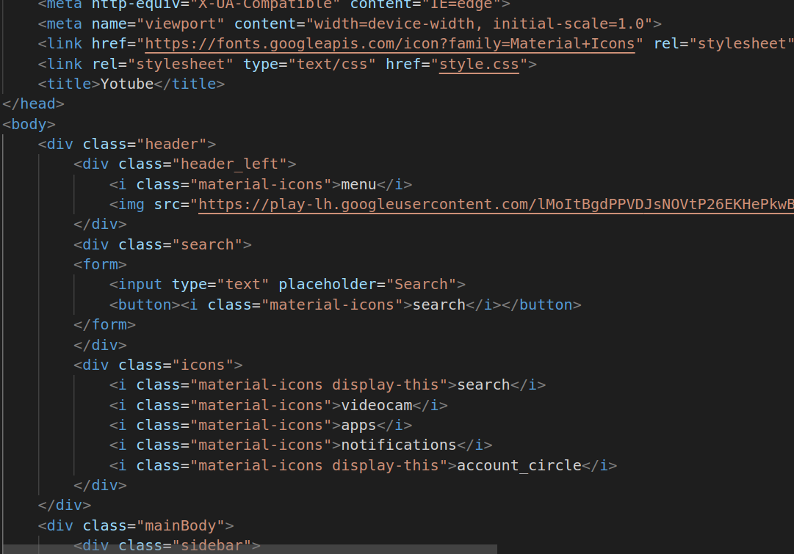
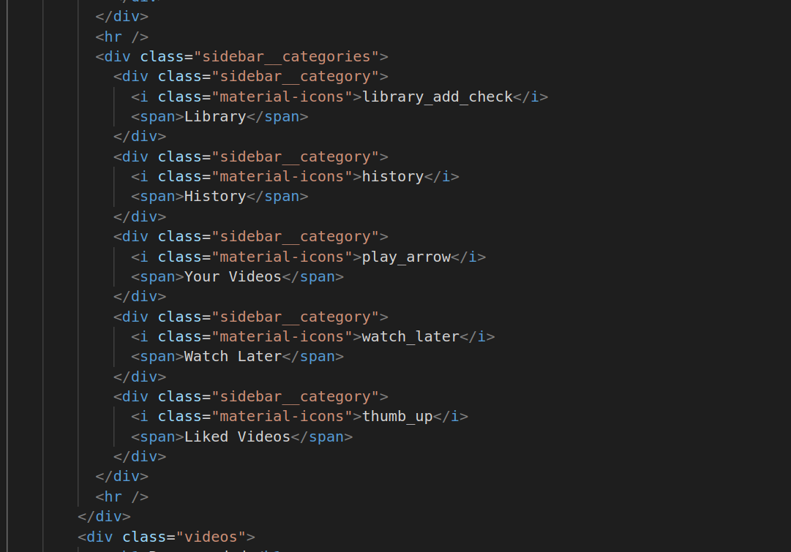
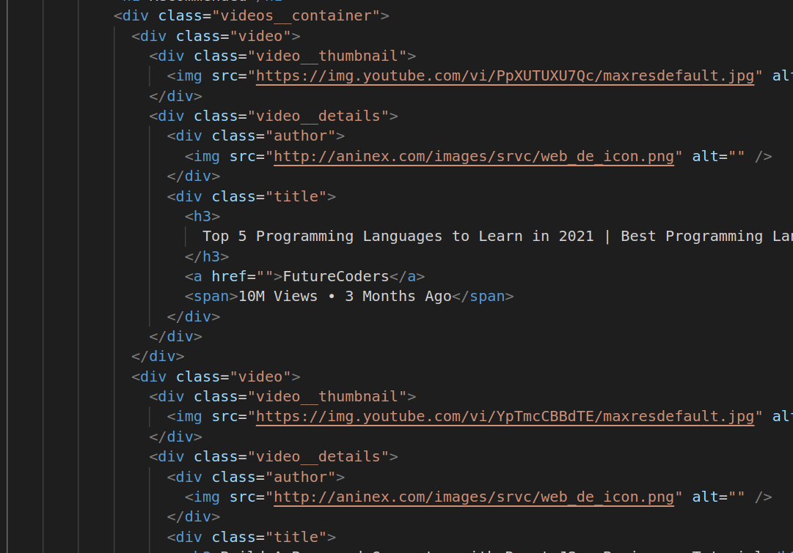
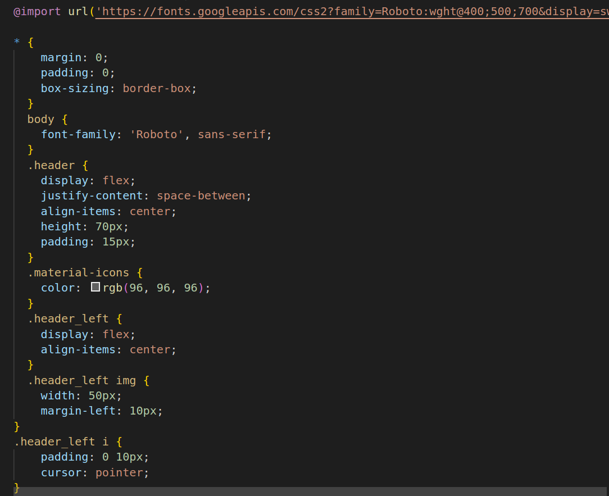
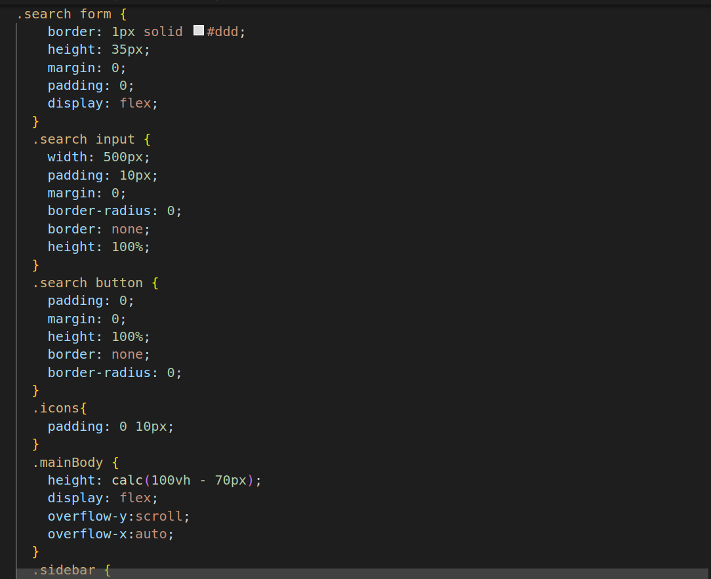
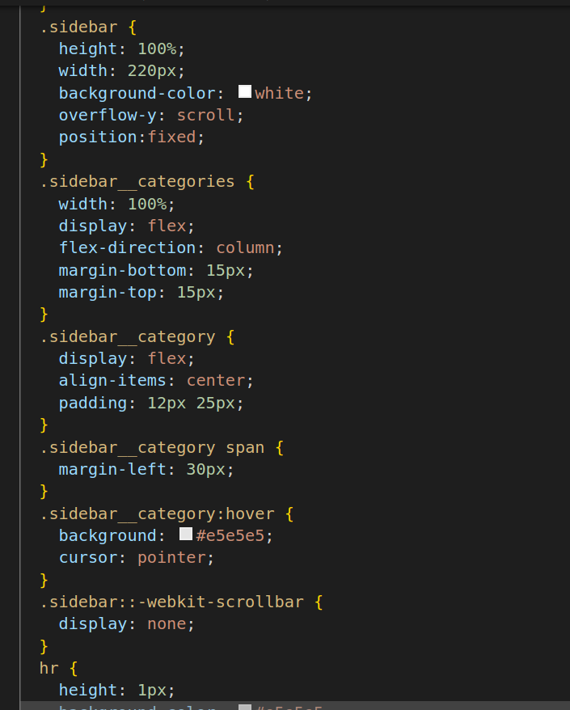
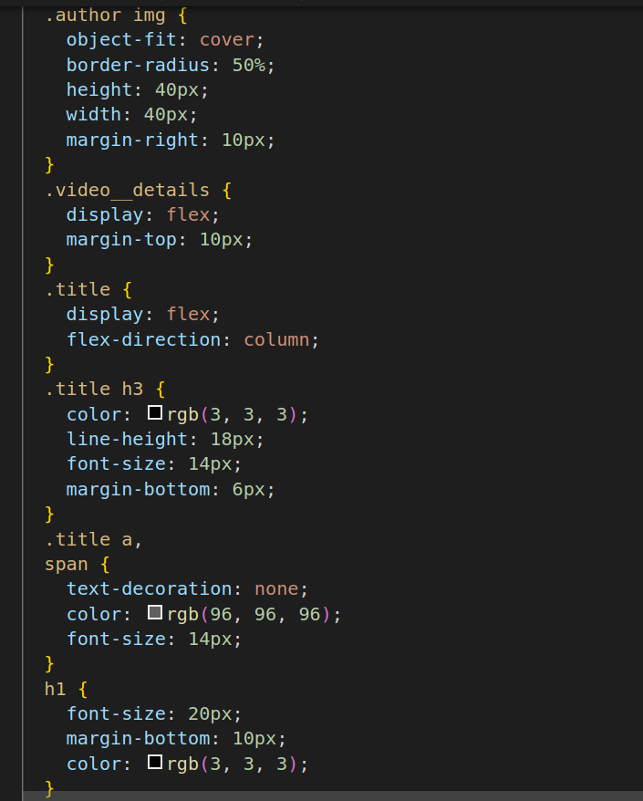
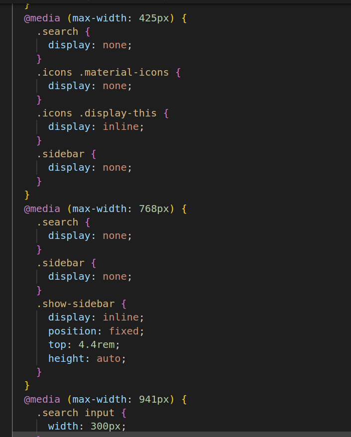

# YouTube cole

1.

* link: This is used to link external resources to the HTML document. In this case, I'm linking to Google Fonts to use the "Material Icons" font and to an external stylesheet named "style.css."
* div is is a generic container element used to group and style elements. In my code, I have two main div elements: one with a class of "header" and another with a class of "mainBody."
* header_left, .search, and .icons: These are div elements inside the "header" container, each serving a different purpose within my website's header section. They likely contain various elements, such as icons, images, and form inputs.

2.

3.

* sidebar and .videos: These are div elements inside the "mainBody" container, responsible for structuring website's sidebar and video content, respectively.
* sidebar__categories: This div contains a list of categories/icons within  sidebar, likely used for navigation.
*hr: This is an HTML element used to create a horizontal line or separator. In my code, it's used to separate categories within the sidebar.
* videos__container: This div is a container for  video content and likely holds multiple individual video elements.
* his div represents an individual video element and contains a thumbnail image and details about the video.

4.

* @import ur:
This rule imports the Google Fonts stylesheet for the Roboto font family. It makes the Roboto font available for use in  HTML document.
* *{ margin: 0; padding: 0; box-sizing: border-box; }
This is a universal selector that sets the margin and padding of all elements to 0 and includes a box-sizing property to ensure that padding and border sizes are included in the total width and height of elements. It's often used to reset default browser styling.
* body { font-family: 'Roboto', sans-serif; }This sets the font family for the entire document's body text to Roboto, with a fallback to a generic sans-serif font if Roboto is unavailable.
* header { ... }These rules define the styling for the header section of your webpage. It sets the display, height, and padding for the header and aligns its content.
* material-icons { ... }
This rule styles elements with the class "material-icons" by setting their color to a shade of gray.
* header_left { ... }
These rules style the left side of the header, including the alignment of its child elements and spacing.

5.

6.

* search form { ... }These rules style the search bar, setting its border, height, and display as flex to align input and button.
* search input { ... }This rule styles the search input field, setting its width, padding, and border properties.
* search button { ... }This rule styles the search button, setting its padding, margin, and border properties.
* icons { ... }This rule styles the container for icons, adding padding.
* mainBody { ... }These rules style the main content area, setting its height, display, and scroll behavior.
* sidebar { ... }These rules style the sidebar, setting its width, background color, and making it fixed so that it doesn't scroll with the content.
* sidebar__categories { ... }These rules style the categories within the sidebar, arranging them in a column layout with margins.
* sidebar__category { ... }These rules style individual sidebar categories, aligning their content and adding padding.
* sidebar::-webkit-scrollbar { ... }
This rule hides the scrollbar within the sidebar in webkit-based browsers.
* hr { ... }This rule styles horizontal lines, setting their height and background color.

7.

8.

* videos { ... }These rules style the videos section, setting its background color, width, height, and positioning.
* videos__container { ... }These rules style the container for videos, arranging them in a flex layout with spacing.
* video { ... }These rules style individual video elements, setting their width and margin.
* video__thumbnail { ... }These rules style the video thumbnails, setting their dimensions and ensuring the images cover the entire area.
* author img { ... }This rule styles the author's image, setting its dimensions, border radius, and margin.
* video__details { ... }These rules style the video details, aligning them and adding margin.
* title { ... }These rules style the video title and related text, defining font colors, sizes, and spacing.
* h1 { ... }This rule styles the level 1 heading, setting its font size, color, and margin.
* Media Queries:These are used to apply different styles based on the screen width. For example, when the screen width is less than 425px, the search bar and sidebar are hidden. The rules inside these media queries allow us to create responsive designs for different screen sizes.
* @media (max-width: 941px) { ... }
This media query adjusts the width of the search input when the screen width is less than 941px.

# Hosted Link
https://nikhitha5511.github.io/Youtube/?authuser=0

